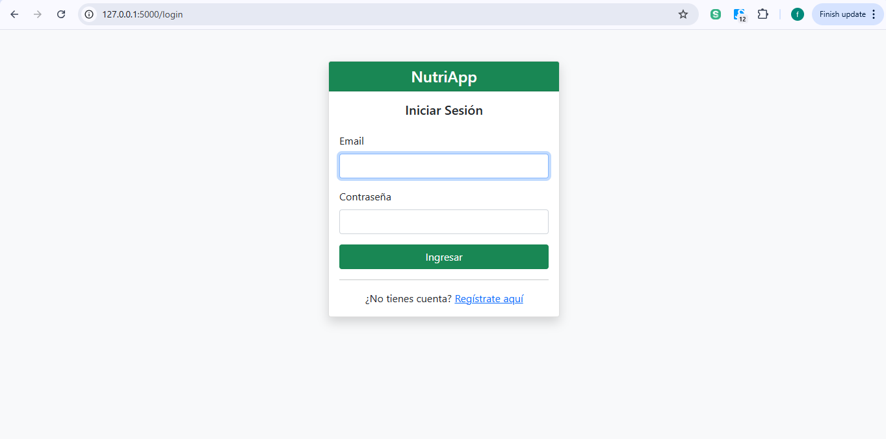

🏥 GestiónNutricional - Plataforma de Gestión para Consultorio Nutricional
Desarrollador: Fernando Aldavera
Materia: Desarrollo de Software Multiplataforma - Proyecto Final
Universidad: UTNG
Fecha: Febrero 2026

📸 Capturas de Pantalla
[]

🎯 Características Principales
Registro y autenticación segura de usuarios
Gestión completa de pacientes: crear, editar, consultar
Registro y seguimiento de consultas médicas
Creación y asignación de planes nutricionales personalizados
Integración de videos educativos de YouTube
Dashboard centralizado con estadísticas y navegación intuitiva

📱 Tecnologías Usadas
Python 3.x
Flask
HTML / CSS / JavaScript
Git / GitHub

🚀 Cómo Instalar
1. Clonar el repositorio:  
   `git clone https://github.com/Fernando44PF/flask_proyecto_nutricion.git`  
   `cd flask_proyecto_nutricion`  
2. Crear entorno virtual:  
   `python -m venv venv`  
   Windows: `venv\Scripts\activate`  
   Mac/Linux: `source venv/bin/activate`  
3. Instalar dependencias:  
   `pip install -r requirements.txt`  
4. Ejecutar la aplicación:  
   `python run.py` o `flask run`  
5. Abrir en el navegador:  
   `http://127.0.0.1:5000/`

👥 Prueba la App
Usuario de prueba: admin@nutricion.com  
Contraseña: admin  

📞 Contacto
Desarrollador: Fernando Aldavera  
Email: fernando@utng.edu.mx  
Profesor: [Nombre del profesor]

Proyecto desarrollado para la materia Desarrollo de Software Multiplataforma - Gestión de Consultorios Nutricionales
